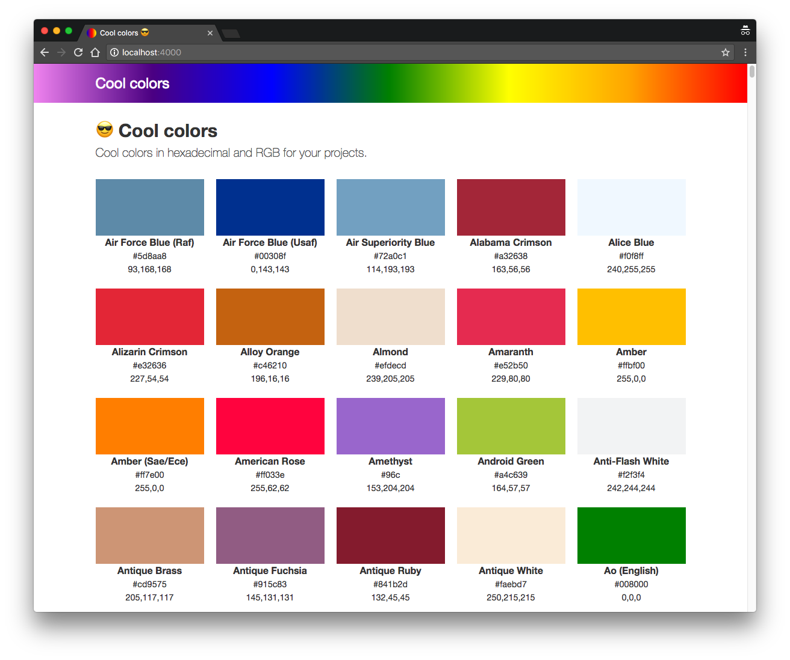

# Cool colors

Cool colors in hexadecimal and RGB for your projects.



## Install

```bash
$ bundle install
$ bundle exec jekyll serve
```

## Source

Colors list source: https://github.com/edent/RGB_Colours.

## Libraries

This website uses:

- [Jekyll](https://jekyllrb.com/)
- [Bootstrap](https://getbootstrap.com)
- [Fuse](http://fusejs.io)
